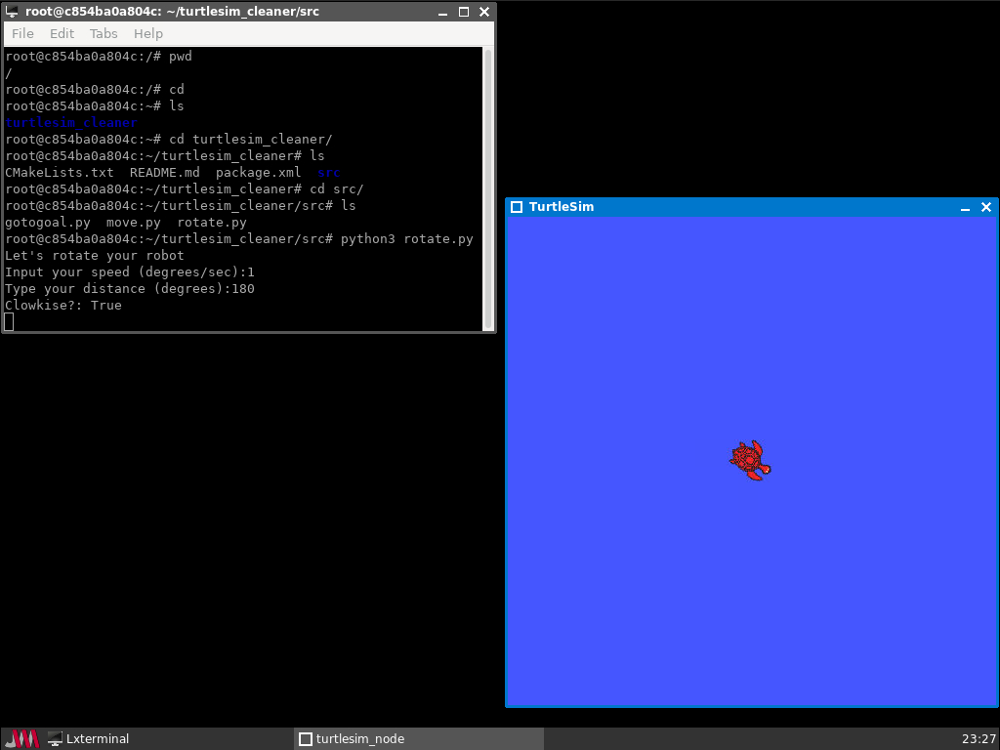

# Example of using ROS in a Docker Container

This example includes:

* ROS Noetic - http://wiki.ros.org/noetic
* TigerVNC - https://tigervnc.org/
* NoVNC - https://novnc.com

It runs the VNC server's X server on display :0 (port 6000) and VNC on port 5900. NoVNC runs its own webserver on port 8000.


## Running

```docker run -p 8000:8000 colinsauze/docker_ros_example:demo /start_turtle.sh```

Open http://localhost:8000 in your web browser to connect to VNC. The password will have been displayed during the container startup.

Or it can be found by running:

```docker exec <container name> cat /tmp/passwd```

### Example programs

In the terminal type the following:

```cd /root/turtlesim_cleaner/src```

```python3 gotogoal.py```

or

```python3 move.py```

or

```python3 rotate.py```

### ROS utilities

Many ROS standard utilities including rqt_plot, rqt_graph and rqt_console are included. 




